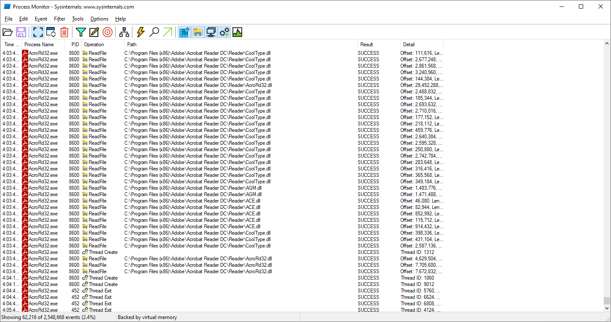
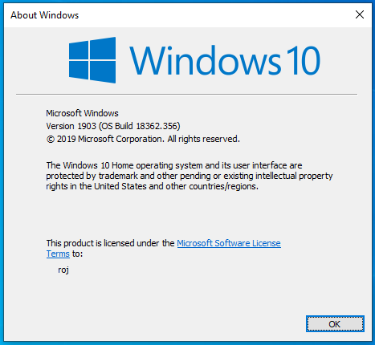
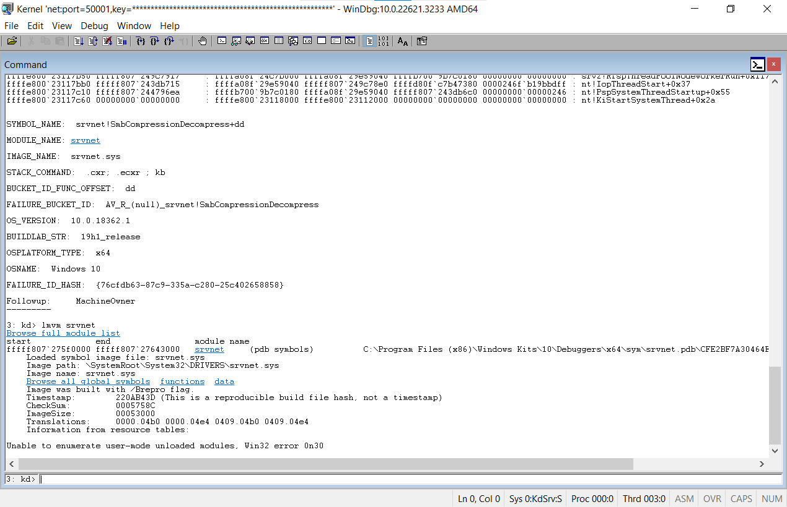
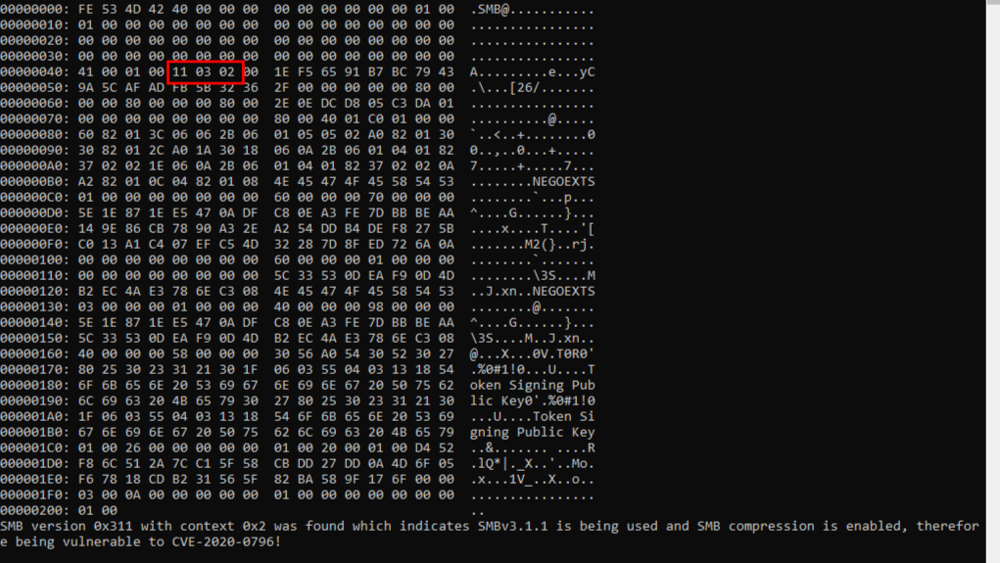
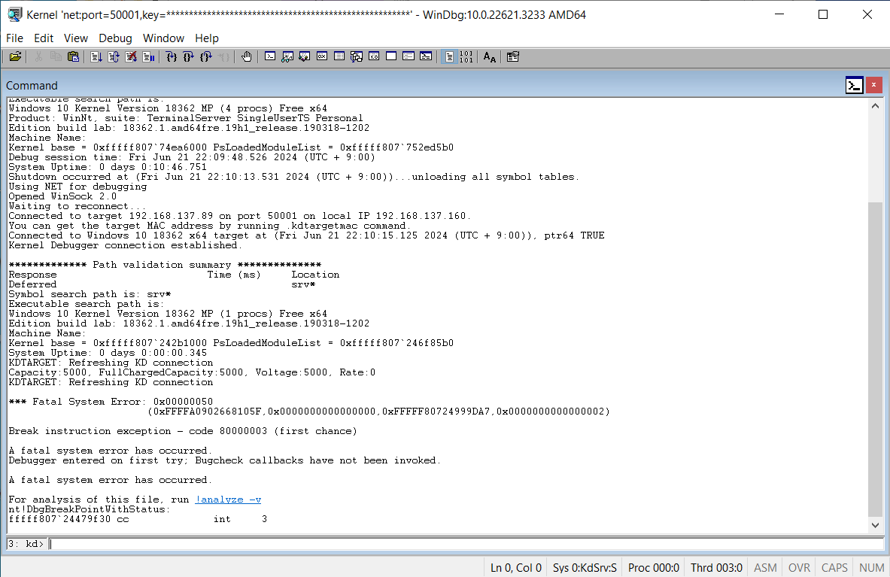
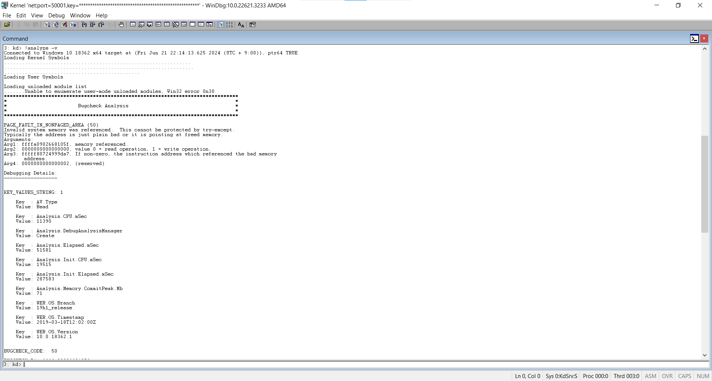
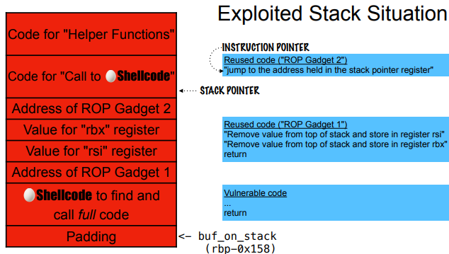
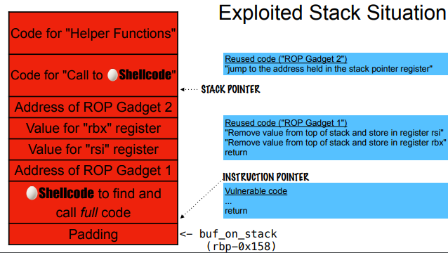

# (Linear) Stack Buffer Overflow (CVE-2021-21574)

|CVE            |CVE-2021-21574                           |
|---------------|-----------------------------------------|
|Software Source|Dell                                     |
|Type           |Firmware                                 |
|SubType        |UEFI BIOS                                |
|Attack Surface |Network Traffic (JSON over HTTPS parsing)|

<br>

### Summary

- Unified Extensible Firmware Interface (UEFI) is a firmware interface specification, predominantly, but not exclusively, used on Intel-based platforms
- Dell Intel-based laptops have a Basic Input Output System (BIOS) that implements UEFI
- This UEFI BIOS has a feature called "Dell BIOSConnect" to support remote BIOS update


- CVE-2021-21574 : Overflow in JSON parsing ("sha256" field)



​	→ Can provide a shellcode payload in hex without worrying about bad characters


<br>

### Vulnerability

```
// Pseudocode derived from assembly
idx = 0
write_ptr = buf_on_stack; //rbp-0x158
while(1) {
    if ( idx >= strnlen(hex_ptr, 20000) )    // exit condition
        break;

    *write_ptr++ = CONVERT_HEX(hex_ptr[idx]) << 4 | 
                   CONVERT_HEX(hex_ptr[idx+1]);    // manually memory copy
    idx += 2;
}
if ( buf_on_stack != calculated_sha256 ) {
	if ( memcmp(buf_on_stack, calculated_sha256, 32) )
		retval = EFI_NOT_FOUND;
	}
}
```


- Analysis














<br>

### POC

- Return-Oriented Programming (ROP)
    - Execute Snippets of existing code ("gadgets"), that end in a "return" assembly instruction
    - Return instruction removes the value at the top of the stack and puts the value into the instruction pointer
        - thus indicating the next gadget of code to execute
    - Used when there are non-executable stack, or address-space layout randomization(ASLR)








### Reference

- https://apps.p.ost2.fyi/learning/course/course-v1:OpenSecurityTraining2+Vulns1001_C-family+2023_v1/block-v1:OpenSecurityTraining2+Vulns1001_C-family+2023_v1+type@sequential+block@a3c5de12340f4b50ab45443de90770e3/block-v1:OpenSecurityTraining2+Vulns1001_C-family+2023_v1+type@vertical+block@90fde1437a46447a93ff061b3dcd0165
