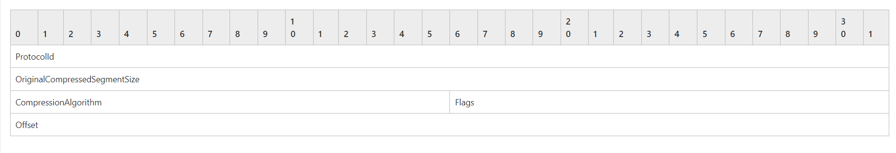
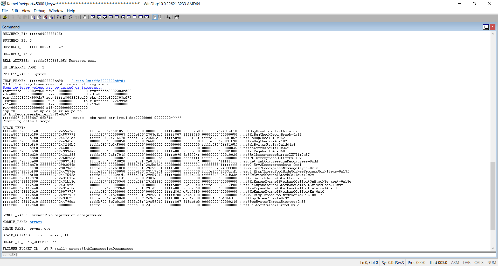

# Integer Overflow (CVE-2020-0796)

### Summary

- Component
    - Microsoft Server Message Block (SMB) Protocol
        - network file sharing protocol
        - SMBV3 supports message compression to reduce network traffic load
        - Message decompression takes place in the srv2.sys kernel driver
        - Network packets should generally be treated as all


<br>


### Vulnerability Analysis

- Attack Surface
    - Network Packets (SMB)
        - SMB 3.1.1 프로토콜에서 조작된 압축 패킷을 압축 해제하는 과정에서 Buffer Overflow 발생
        - 조작된 SMB 헤더(SMB2_COMPRESSION_TRANSFORM_HEADER)와 커널에서 사용하는 srv2.sys 드라이버 내 Srv2DecompressData에서 Integer Overflow 발생

            ​	→ Key : OriginalCompressedSegmentSize, Offset/Length

        - CVE-2020-0796 is a bug in Windows 10 1903/1909's new SMB3 compression capability. SMB protocol version 3.1.1 introduces the ability for a client or server to advertise compression cabilities, and to selectively compress SMB3 messages as beneficial. To accomplish this, when negotiating an SMB session, the client and server must both include a SMB2_COMPRESSION_CAPABILITIES as documented in [MS-SMB2 2.2.3.1.3](https://docs.microsoft.com/en-us/openspecs/windows_protocols/ms-smb2/78e0c942-ab41-472b-b117-4a95ebe88271).
        - Once a session is negotiated with this capability, either the client or the server can selectively compress certain SMB messages. To do so, the entire SMB packet is compressed, and a transformed header is prepended, as documented in [MS-SMB2 2.2.42](https://docs.microsoft.com/en-us/openspecs/windows_protocols/ms-smb2/1d435f21-9a21-4f4c-828e-624a176cf2a0). This header is a small (16 bytes) structure with a magic value, the uncompressed data size, the compression algorithm used, and an offset value.
        - CVE-2020-0796 is caused by a lack of bounds checking in that offset size, which is directly passed to several subroutines. Passing a large value in will cause a buffer overflow, and crash the kernel. With further work, this could be developed into a RCE exploit.

```
signed __int64 __fastcall Srv2DecompressData(SRV2_WORKITEM *workitem)
{
  // declarations omitted
  ...
  request = workitem->psbhRequest;
  if ( request->dwMsgSize < 0x10 )
    return 0xC000090Bi64;
  compressHeader = *(CompressionTransformHeader *)request->pNetRawBuffer;
  ...
  // (A) an integer overflow occurs here
  newHeader = SrvNetAllocateBuffer((unsigned int)(compressHeader.originalCompressedSegSize + compressHeader.offsetOrLength), 0i64);
  if ( !newHeader )
    return 0xC000009Ai64;
  // (B) the first subsequent buffer overflow occurs in SmbCompressionDecompress
  if ( SmbCompressionDecompress(
        compression_type,
        &workitem->psbhRequest->pNetRawBuffer[compressHeader.offsetOrLength + 16],
        workitem->psbhRequest->dwMsgSize - compressHeader.offsetOrLength - 16,
        &newHeader->pNetRawBuffer[compressHeader.offsetOrLength],
        compressHeader.OriginalCompressedSegSize,
        &finalDecompressedSize) < 0
      || finalDecompressedSize != compressHeader.originalCompressedSegSize) )
  {
    SrvNetFreeBuffer(newHeader);
    return 0xC000090Bi64;
  }
  if ( compressHeader.offsetOrLength )
  {
    // (C) the second buffer overflow occurs here
    memmove(newHeader->pNetRawBuffer, workitem->psbhRequest->pNetRawBuffer + 16, compressHeader.offsetOrLength);
  }
  newHeader->dwMsgSize = compressHeader.OffsetOrLength + fianlDecompressedSize;
  Srv2ReplaceReceiveBuffer(workitem, newHeader);
  return 0i64;
}

```


<br>


### POC (BSOD)

- Analysis Environment
    - 
        Attacker : Windows 10 21H2 (OS Build 19044.1288)
    - Victim : Windows 10 1903 (OS Build 18362.356)
    - Victim : 445 port open
    - Scanner : [https://github.com/ioncodes/SMBGhost](https://github.com/ioncodes/SMBGhost)
        
- Analysis
    - Attacker : POC 실행
        
    - Victim : BSOD 발생





- STACK_TEXT
    - nt!KiPageFault+0x360
    - nt!RtlDecompressBufferLZNT1+0x57
    - nt!RtlDecompressBufferEx2+0x66
    - srvnet!SmbCompressionDecompress+0xdd
    - srv2!Srv2DecompressData+0xe1


<br>


### Reference

- https://apps.p.ost2.fyi/learning/course/course-v1:OpenSecurityTraining2+Vulns1001_C-family+2023_v1/block-v1:OpenSecurityTraining2+Vulns1001_C-family+2023_v1+type@sequential+block@6bf3edd797f94357b414058110f51053/block-v1:OpenSecurityTraining2+Vulns1001_C-family+2023_v1+type@vertical+block@48899865d7c04d7383d8931b517f37bb

- [https://m.blog.naver.com/skinfosec2000/221918047244](https://m.blog.naver.com/skinfosec2000/221918047244)
- [https://ricercasecurity.blogspot.com/2020/04/ill-ask-your-body-smbghost-pre-auth-rce.html](https://ricercasecurity.blogspot.com/2020/04/ill-ask-your-body-smbghost-pre-auth-rce.html)
- [https://shhoya.github.io/vuln_smb_introduction.html](https://shhoya.github.io/vuln_smb_introduction.html)
- [https://msrc.microsoft.com/update-guide/en-US/advisory/CVE-2020-0796](https://msrc.microsoft.com/update-guide/en-US/advisory/CVE-2020-0796)

