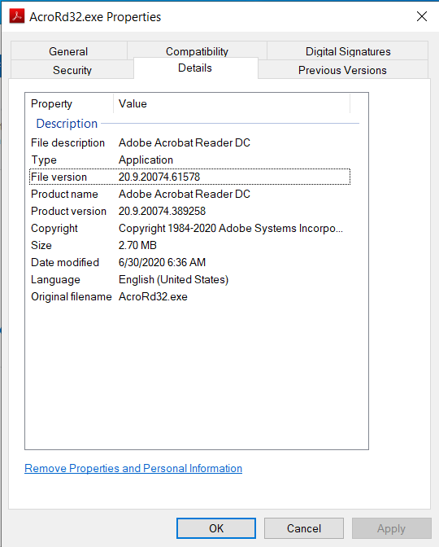
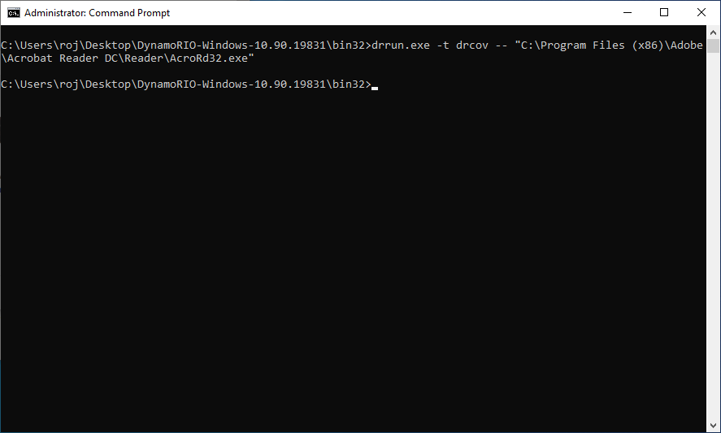
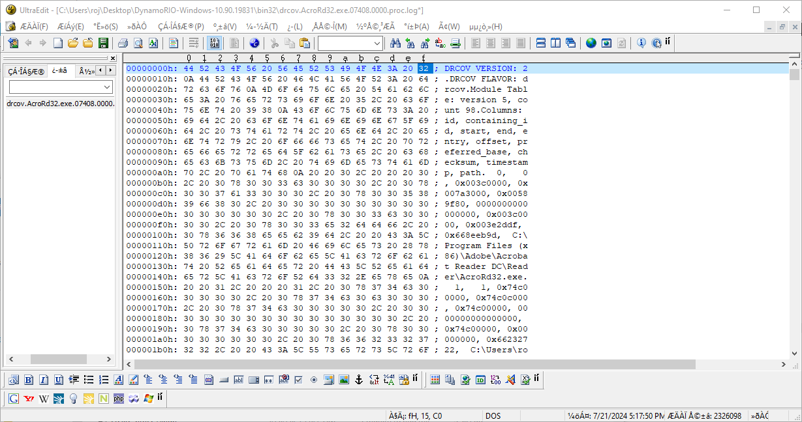

# Use After Free (CVE-2020-9715)

### Abstract

CVE-2020-9715 is a Use-After-Free vulnerability of the ESObject that was reported via the Zero Day Initiative and patched in Adobe Security Bulletin APSB20-48.


<br>


### Vulnerability Analysis

ESObjects are EScript Objects associated with JavaScript objects.

When constructing Data "ESObjects", the pointers to allocated Data ESObjects are stored in an object cache so that when a Data ESObject with the same associated PDDoc structure and name needs to constructed, the Data ESObject pointer from the cache is used instead of performing a new allocation.

The key to this object cache is a PDDoc object address plus the name of the Data ESObject.

The issue is that when the Data ESObject is freed, the ESObject pointer in the object cache is not removed and therefore becomes

stale.

The issue arises because when the ESObject pointer is added in the object cache, the type of the name ESString used is ANSI. However, when deleting an ESObject pointer entry in the object cache, the type of the name ESSting used when wearching for an entry to delete is Unicode. As a result, the ESObject pointer entry in the object cache is not found, and so is never deleted.










<br>


### Trouble Shooting

- [https://stackoverflow.com/questions/46602166/how-to-control-multi-process-debugging](https://stackoverflow.com/questions/46602166/how-to-control-multi-process-debugging)

- ```
  1) Dynamorio로 커버리지 측정
  2) Light house에서 커버리지 파일 로드 (Hex Editor로 버전 정보 3 → 2로 수정)
  3) ImportTable에서 CreateFile이나 ReadFile 크로스 레퍼런스 확인하고 파일을 오픈하는 지점이 될 부분(Light house에서 초록색으로 표기된 부분)에 bp 설정
  4) 파일 오픈 모듈은 Api monitor 등으로 식별
  
  => 여기선 pdf에 접근하는게 Acrord32.dll이므로 해당 파일을 IDA에서 열고 디버거 옵션 세팅 때 application은 acrord32.exe 설정
  ```

  

<br>


### Reference

- [https://www.zerodayinitiative.com/blog/2020/9/2/cve-2020-9715-exploiting-a-use-after-free-in-adobe-reader](https://www.zerodayinitiative.com/blog/2020/9/2/cve-2020-9715-exploiting-a-use-after-free-in-adobe-reader)
- [https://blog.exodusintel.com/2021/04/20/analysis-of-a-use-after-free-vulnerability-in-adobe-acrobat-reader-dc/](https://blog.exodusintel.com/2021/04/20/analysis-of-a-use-after-free-vulnerability-in-adobe-acrobat-reader-dc/)
- [https://www.pixiepointsecurity.com/blog/nday-cve-2020-9715.html](https://www.pixiepointsecurity.com/blog/nday-cve-2020-9715.html)
- [https://asec.ahnlab.com/en/26310/](https://asec.ahnlab.com/en/26310/)
- [https://cosyp.tistory.com/236](https://cosyp.tistory.com/236)
