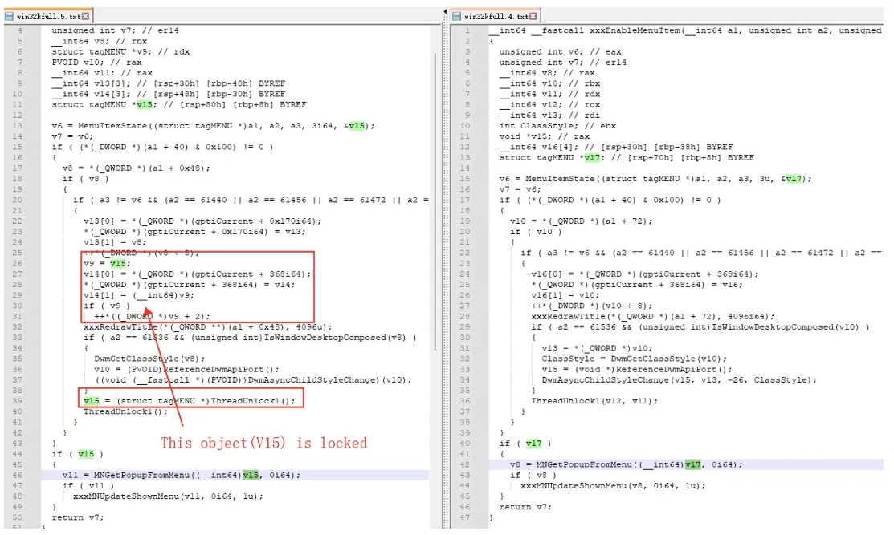

# Use After Free (CVE-2023-29336)

***---------------------------------------- IN PROGRESS ----------------------------------------***

 

### Background

- The recent Microsoft security patch uncovered a critical privilege escalation vulnerability within win32k, which has already been exploited in real-world attacks.
- This analysis was performed on Server 2016.

 

### Analysis

- It appears that the reference count of a particular object undergoes multiple increments.

 

### POC
